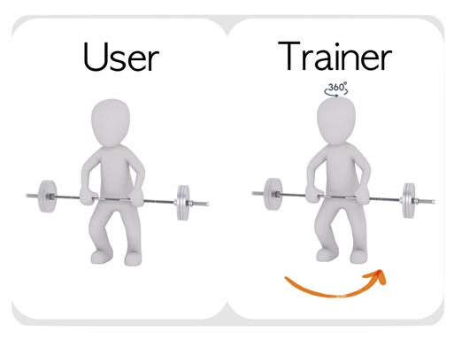
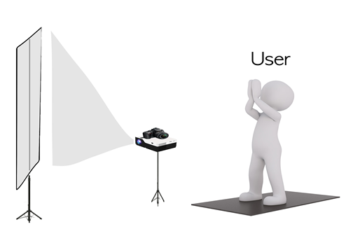
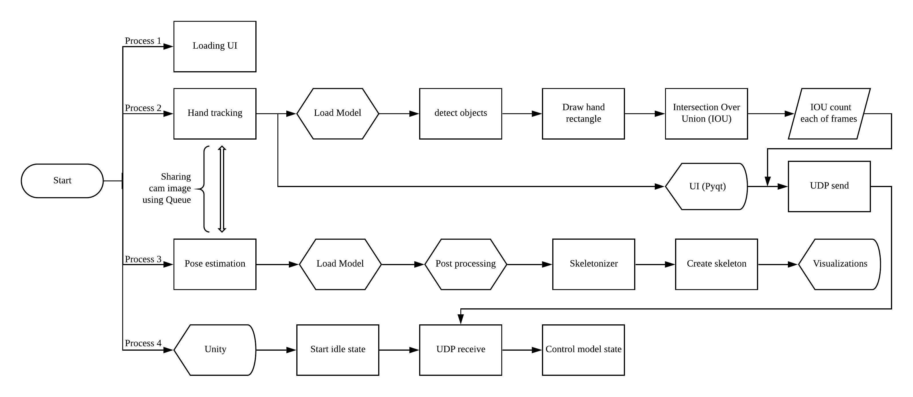
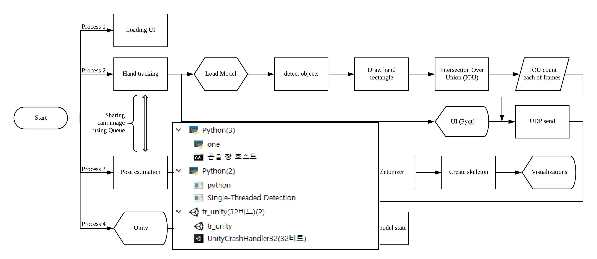

# Graduate Product
Modern people's interest in health is steadily increasing, and accordingly, the domestic market size is estimated to be about 2.4 trillion won.
The growing number of "home training" people doing fitness training at home reflects the current situation.
The biggest limitation of fitness is the low accessibility of beginners and the difficulty of determining whether they are in the right posture, and we have devised an AI-fitness program to technically overcome these limitations and inconveniences.
The purpose of the program is to improve access to fitness and to help exercise in the right posture without an expert being next to you.

----
# TEAM
4 students from Incheon National University majoring in Computer Engineering.
I was in charge of the role below.
 - Planning during project progress, planning progress direction.
 -  Responsible for artificial intelligence such as handtracking and pose-estimation
 - Transform and control technologies developed in other environments into the environment of the current project
 - Algorithms and technologies implemented in each part are produced in one integrated program
 - Optimized adjustment of program operation to match real-time processing
   (Multi-processing, video sharing using queues, GPU quota adjustment)
 - GUI implementation using PyQt5

----
# Scenario image

---
# Work flow

---
# Video
Link : [https://youtu.be/tOAWtL5EW3w](https://youtu.be/tOAWtL5EW3w)
